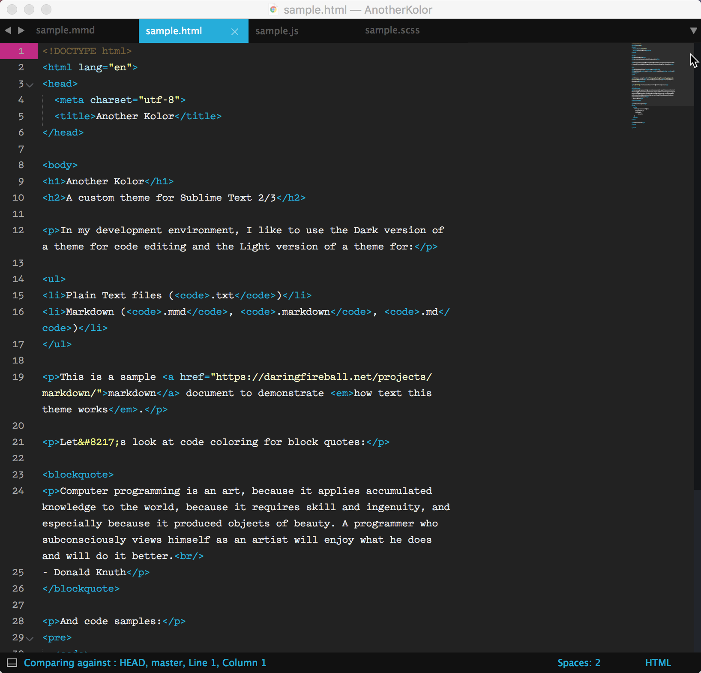
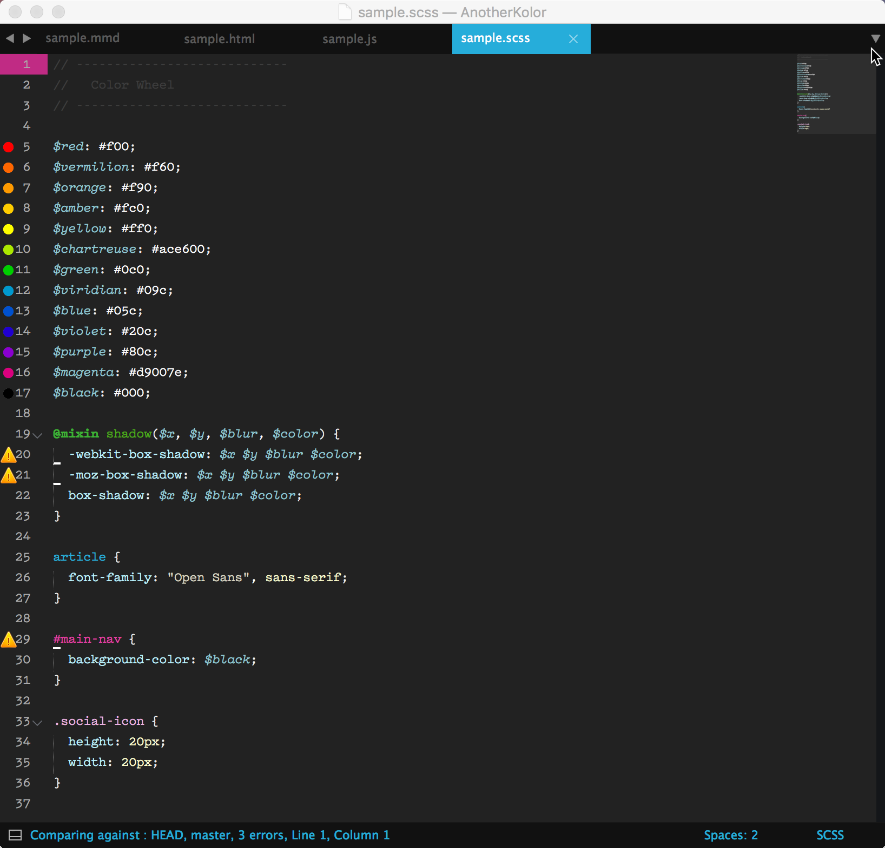
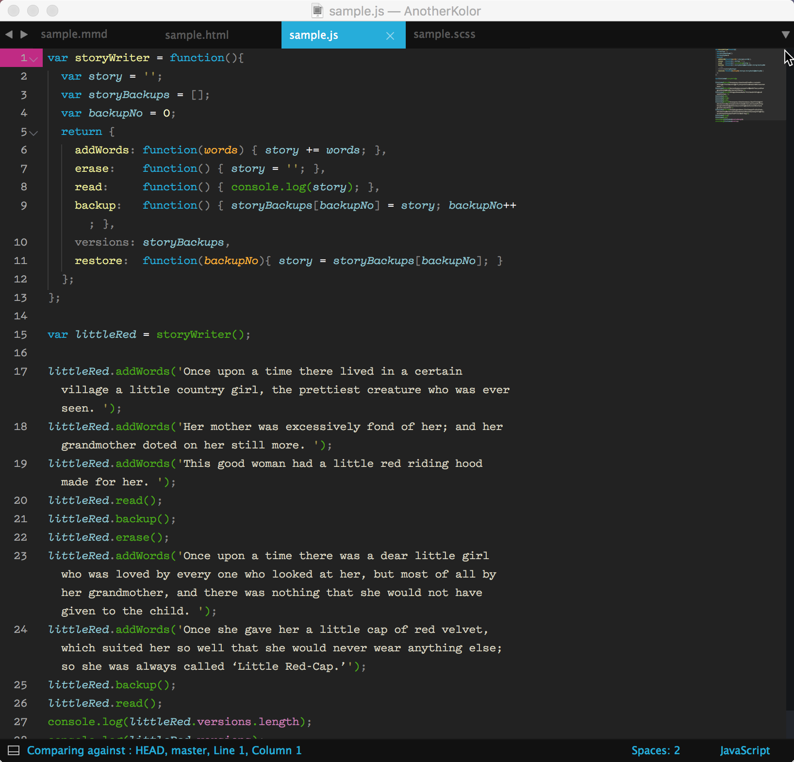
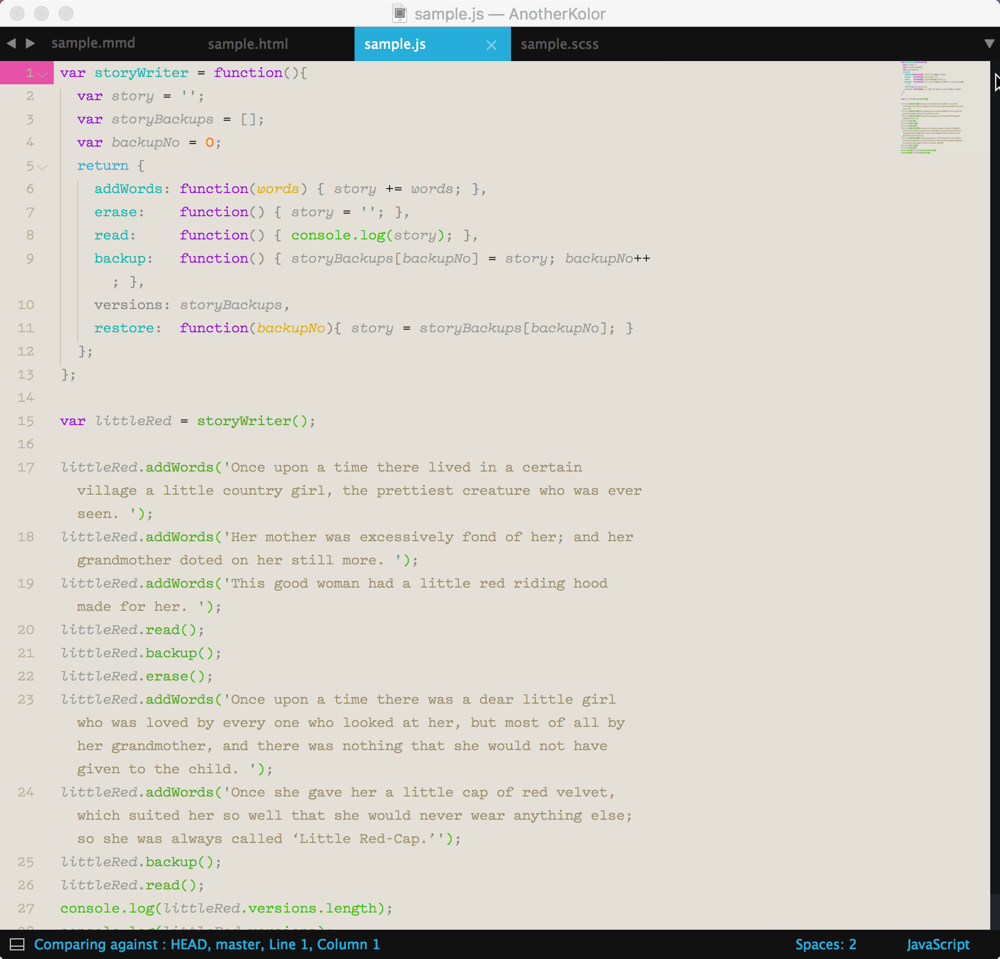

# Another Kolor
### A set of themes for Sublime Text 2/3
Another Kolor is a color scheme for web developers with code coloring configured for the following languages:

* HTML
* CSS and Sass
* JavaScript
* Markdown
* Ruby and Rails

## HTML

HTML code coloring for those who like their angle brackets and tag names to be the same color.

## CSS and Sass

CSS and Sass code coloring to highlight IDs, classes and elements with vibrant colors so they stand out in the editor and minimap. This is helpful if you calculate specificity points for style rules.

## JavaScript

The parentheses associated with function calls are colored green to distinguish them from function definitions.

## Markdown

Vibrant colors distinguish between lists, blockquotes, links and inline code - helpful for minimap navigation.

This is a BETA color scheme that I continue to edit and tweak as I use it over time. 

Another Kolor also includes configuration for the following Sublime Text packages:

* BracketHighlighter
* GitGutter

